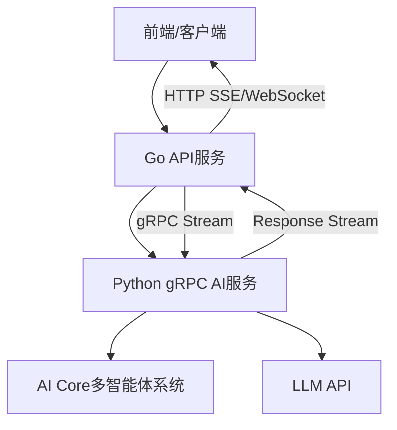

# 🚀 Go+Python gRPC流式架构实现指南

## 📋 架构概述

该架构实现了Go服务作为API网关，通过gRPC调用Python AI服务，并支持流式输出。



## 🛠️ 实现步骤

### 1. 编译Proto文件

```bash
# 安装protoc和相关插件
# 对于Python
pip install grpcio-tools

# 对于Go  
go install google.golang.org/protobuf/cmd/protoc-gen-go@latest
go install google.golang.org/grpc/cmd/protoc-gen-go-grpc@latest

# 编译proto文件
protoc --go_out=. --go-grpc_out=. proto/ai_service_stream.proto
protoc --python_out=ai-core/ --grpc_python_out=ai-core/ proto/ai_service_stream.proto
```

### 2. Python gRPC服务端

在`ai-core/`目录下：

```bash
# 安装依赖
pip install grpcio grpcio-tools

# 启动服务
python grpc_server.py
```

### 3. Go服务集成

在Go服务中集成gRPC客户端：

```go
// main.go 中添加
import "github.com/authorizerdev/authorizer/server/services"

// 初始化AI gRPC客户端
func initAIService() error {
    grpcClient, err := services.NewAIGRPCClient("localhost:50051")
    if err != nil {
        return fmt.Errorf("初始化AI gRPC客户端失败: %w", err)
    }
    
    // 注册到全局变量或依赖注入容器
    handlers.AIGRPCClientInstance = grpcClient
    return nil
}
```

### 4. 路由配置

在`server/routes/routes.go`中添加：

```go
// AI流式服务路由
aiStreamGroup := router.Group("/ai/stream")
aiStreamGroup.Use(middlewares.AuthMiddleware())
{
    streamHandler := handlers.NewAIStreamHandler(grpcClient)
    
    aiStreamGroup.POST("/chat", streamHandler.StreamChatHandler())
    aiStreamGroup.POST("/workflow/generate", streamHandler.StreamWorkflowGenerateHandler())
    aiStreamGroup.GET("/health", streamHandler.HealthCheckHandler())
}
```

## 🎯 API使用示例

### 流式聊天API

```bash
curl -X POST http://localhost:8080/ai/stream/chat \
  -H "Content-Type: application/json" \
  -H "Authorization: Bearer YOUR_TOKEN" \
  -d '{
    "model": "claude-3-5-sonnet-20241022",
    "messages": [
      {"role": "user", "content": "你好，请介绍一下自己"}
    ]
  }'
```

响应（SSE格式）：
```
data: {"content":"你好！","is_complete":false,"tokens_used":2}

data: {"content":"我是Claude","is_complete":false,"tokens_used":5}

data: {"content":"","is_complete":true,"finish_reason":"stop","tokens_used":15}
```

### 流式工作流生成API

```bash
curl -X POST http://localhost:8080/ai/stream/workflow/generate \
  -H "Content-Type: application/json" \
  -H "Authorization: Bearer YOUR_TOKEN" \
  -d '{
    "requirement": "创建一个用户注册流程，包含邮箱验证和数据库存储"
  }'
```

响应：
```
data: {"workflow_id":"wf_1234","status":"started","current_step":"initialization","progress":0.0}

data: {"workflow_id":"wf_1234","status":"processing","current_step":"requirement_analysis","progress":0.33}

data: {"workflow_id":"wf_1234","status":"completed","progress":1.0,"final_outputs":{"workflow_name":"用户注册流程"}}
```

## 🔧 服务配置

### Python服务配置

在`ai-core/`目录创建`config.yaml`：

```yaml
grpc:
  host: "0.0.0.0"
  port: 50051
  max_workers: 10

llm:
  default_model: "claude-3-5-sonnet-20241022"
  timeout: 300
  
logging:
  level: "INFO"
  format: "json"
```

### Go服务配置

在环境变量中添加：

```bash
# AI gRPC服务地址
AI_GRPC_ADDRESS=localhost:50051

# 连接超时（秒）
AI_GRPC_TIMEOUT=30

# 最大重试次数
AI_GRPC_MAX_RETRIES=3
```

## 🚀 部署方案

### Docker Compose部署

```yaml
version: '3.8'

services:
  authorizer-go:
    build: 
      context: ./server
      dockerfile: Dockerfile
    ports:
      - "8080:8080"
    environment:
      - AI_GRPC_ADDRESS=ai-python:50051
    depends_on:
      - ai-python
      
  ai-python:
    build:
      context: ./ai-core
      dockerfile: Dockerfile
    ports:
      - "50051:50051"
    environment:
      - CLAUDE_API_KEY=${CLAUDE_API_KEY}
    volumes:
      - ./ai-core:/app
```

### Kubernetes部署

```yaml
# ai-python-deployment.yaml
apiVersion: apps/v1
kind: Deployment
metadata:
  name: ai-python
spec:
  replicas: 3
  selector:
    matchLabels:
      app: ai-python
  template:
    metadata:
      labels:
        app: ai-python
    spec:
      containers:
      - name: ai-python
        image: your-registry/ai-python:latest
        ports:
        - containerPort: 50051
        env:
        - name: CLAUDE_API_KEY
          valueFrom:
            secretKeyRef:
              name: ai-secrets
              key: claude-api-key

---
apiVersion: v1
kind: Service
metadata:
  name: ai-python-service
spec:
  selector:
    app: ai-python
  ports:
  - port: 50051
    targetPort: 50051
```

## 📊 性能优化

### gRPC连接池

```go
type AIGRPCClientPool struct {
    clients []*AIGRPCClient
    current int64
    mu      sync.RWMutex
}

func (p *AIGRPCClientPool) GetClient() *AIGRPCClient {
    p.mu.Lock()
    defer p.mu.Unlock()
    
    client := p.clients[p.current%int64(len(p.clients))]
    p.current++
    return client
}
```

### 负载均衡配置

```go
// gRPC客户端负载均衡
conn, err := grpc.Dial(
    "dns:///ai-python-service:50051",
    grpc.WithDefaultServiceConfig(`{"loadBalancingPolicy":"round_robin"}`),
    grpc.WithTransportCredentials(insecure.NewCredentials()),
)
```

## 🛡️ 错误处理和监控

### 错误重试机制

```go
func (c *AIGRPCClient) StreamChatWithRetry(ctx context.Context, userID, modelName string, messages []map[string]string, responseChan chan<- *StreamChatResponse) error {
    maxRetries := 3
    for i := 0; i < maxRetries; i++ {
        err := c.StreamChat(ctx, userID, modelName, messages, responseChan)
        if err == nil {
            return nil
        }
        
        if i < maxRetries-1 {
            time.Sleep(time.Duration(i+1) * time.Second)
            continue
        }
        return err
    }
    return nil
}
```

### 健康检查

```bash
# Go服务健康检查
curl http://localhost:8080/ai/stream/health

# 预期响应
{"status":"healthy"}
```

## 📈 优势总结

✅ **架构清晰**: Go专注API层，Python专注AI逻辑  
✅ **性能优异**: gRPC二进制协议，低延迟高吞吐  
✅ **流式体验**: 实时响应，用户体验更好  
✅ **可扩展性**: 服务独立部署，水平扩展容易  
✅ **类型安全**: Protobuf强类型定义  
✅ **语言优势**: Go高并发 + Python AI生态  

## 🚨 注意事项

1. **Proto文件同步**: 确保Go和Python使用相同的proto定义
2. **错误处理**: 网络异常、服务不可用等情况
3. **资源管理**: 及时关闭gRPC连接和channel
4. **监控告警**: 添加服务监控和性能指标
5. **安全考虑**: gRPC通信加密和认证

这个架构完全可以满足您的需求，实现了Go服务只提供API层，通过gRPC调用Python服务，并支持流式输出！ 