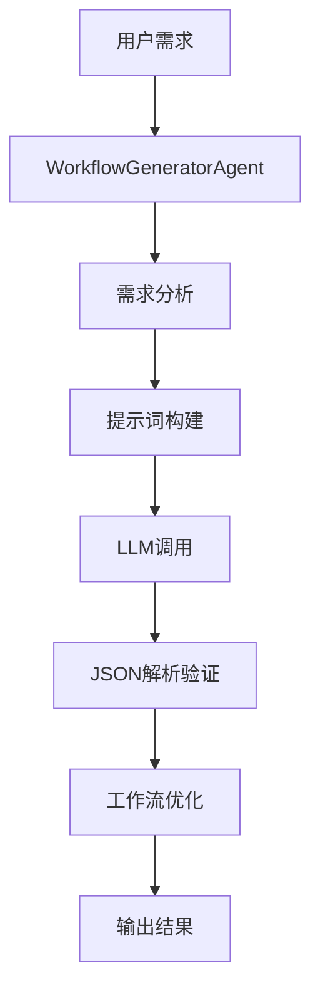

# 工作流生成智能体系统总结

## 🎯 项目概述

基于您提供的工作流节点定义规范，我已经为您创建了一个完整的**工作流生成智能体系统**。该系统能够根据用户的自然语言需求描述，自动生成符合您规范的JSON格式工作流定义。

## 📁 文件结构

```
ai-core/
├── agents/
│   ├── __init__.py                    # 智能体包初始化
│   ├── base_agent.py                  # 基础智能体抽象类
│   └── workflow_generator_agent.py    # 工作流生成智能体
├── prompts/
│   ├── __init__.py                    # 提示词包初始化
│   └── simple_prompts.py              # 简化提示词模板
├── test_workflow_generator.py         # 测试示例
├── WORKFLOW_GENERATOR_GUIDE.md        # 详细使用指南
└── WORKFLOW_AGENT_SUMMARY.md          # 总结文档(本文件)
```

## 🚀 核心功能

### 支持的工作流节点类型

1. **workflowStart** - 工作流开始节点
2. **workflowEnd** - 工作流结束节点  
3. **condition** - 条件判断节点
4. **code** - 代码执行节点
5. **chatWithLLM** - LLM聊天节点
6. **dbQuery** - 数据库查询节点
7. **httpRequest** - HTTP请求节点

### 智能体能力

- 🧠 **需求理解**: 解析自然语言描述，识别业务流程
- 🔧 **节点选择**: 根据需求自动选择最合适的节点类型
- 🔗 **连接设计**: 智能设计节点间的数据流向和连接
- ✅ **格式验证**: 确保生成的JSON格式完全符合规范
- 📐 **布局优化**: 自动优化节点位置，形成清晰流向

## 💻 使用示例

### 基本使用

```python
from agents.workflow_generator_agent import WorkflowGeneratorAgent

# 创建智能体实例
agent = WorkflowGeneratorAgent(
    model_service=your_model_service,
    workflow_engine=None,
    data_processor=None
)

# 生成工作流
result = await agent.execute(
    task_description="创建一个智能客服工作流，支持问题分类和专业回答",
    context={
        "domain": "客户服务",
        "question_types": ["技术问题", "商务咨询", "投诉建议"]
    },
    parameters={
        "complexity_level": "medium",
        "include_error_handling": True
    }
)

if result.success:
    workflow = result.result["workflow"]
    print(f"生成成功！节点数量: {len(workflow['nodes'])}")
```

### 典型使用场景

#### 1. 数据分析工作流
```python
task_description = "创建数据分析工作流，从数据库查询销售数据，计算趋势，生成AI洞察报告"
context = {
    "data_source": "PostgreSQL",
    "analysis_types": ["趋势分析", "同比分析"],
    "output_format": "可视化报告"
}
```

#### 2. 智能客服工作流
```python
task_description = "构建智能客服系统，根据问题类型自动路由到不同的专业AI助手"
context = {
    "question_types": ["技术", "商务", "投诉"],
    "response_style": "专业友好"
}
```

#### 3. 文档处理工作流
```python
task_description = "设计文档处理流程，支持在线获取、内容提取、摘要生成"
context = {
    "document_types": ["PDF", "网页", "Word"],
    "processing_options": ["摘要", "翻译", "关键词提取"]
}
```

## 🔧 技术架构

### 智能体架构



### 核心组件

1. **BaseAgent**: 提供通用的智能体框架
   - 执行流程管理
   - 错误处理
   - 超时控制
   - 结果验证

2. **WorkflowGeneratorAgent**: 专门的工作流生成器
   - 专业提示词设计
   - JSON格式验证
   - 节点连接优化
   - 布局自动调整

3. **提示词系统**: 结构化的提示词模板
   - 系统提示词（规范和要求）
   - 用户提示词（具体需求）
   - 场景化模板

## 📋 生成的工作流格式

生成的工作流严格按照您提供的规范：

```json
{
  "nodes": [
    {
      "id": "唯一节点ID",
      "type": "节点类型",
      "position": {"x": 坐标, "y": 坐标},
      "data": {
        "showInputs": true/false,
        "showOutputs": true/false,
        "label": "节点标签",
        "inputs": [输入字段数组],
        "outputs": [输出字段数组],
        "hasCustomHandle": true/false  // 条件节点
      }
    }
  ],
  "edges": [
    {
      "source": "源节点ID",
      "target": "目标节点ID", 
      "id": "连接标识符",
      "sourceHandleId": "条件分支ID"  // 条件节点专用
    }
  ]
}
```

## ✨ 智能体优势

### 1. 严格规范遵循
- 完全按照您提供的节点定义规范
- 确保所有字段和结构正确
- 验证JSON格式有效性

### 2. 智能化设计
- 理解自然语言需求
- 自动选择合适的节点类型
- 智能设计数据流向

### 3. 错误处理
- 多重验证机制
- 自动修复常见问题
- 详细错误提示

### 4. 扩展性强
- 模块化架构设计
- 易于添加新节点类型
- 支持自定义提示词

## 🎯 提示词设计要点

### 系统提示词核心内容

1. **节点类型说明**: 详细介绍每种节点的用途和配置
2. **连接规则**: valuePath格式和数据流向规则
3. **生成要求**: JSON格式、ID唯一性、布局规范
4. **质量标准**: 完整性、正确性、可执行性

### 用户提示词构建

1. **任务描述**: 用户的具体需求
2. **上下文信息**: 业务背景、约束条件
3. **生成参数**: 复杂度、格式要求等
4. **明确指示**: 只返回JSON，不要其他内容

## 🔍 测试验证

创建了完整的测试框架：

1. **MockModelService**: 模拟LLM服务，返回标准工作流
2. **测试用例**: 涵盖不同场景和复杂度
3. **结果验证**: 检查JSON格式、节点完整性、连接有效性
4. **保存输出**: 自动保存生成的工作流文件

## 📈 使用建议

### 1. 需求描述最佳实践
- ✅ **具体明确**: "创建电商订单处理流程，包含验证、支付、发货"
- ❌ **模糊不清**: "做一个订单系统"

### 2. 上下文信息设置
```python
context = {
    "business_domain": "在线教育",
    "user_roles": ["学生", "教师"],
    "integration_systems": ["支付", "视频会议"],
    "performance_requirements": "1000并发"
}
```

### 3. 复杂度级别选择
- **simple**: 基础流程(3-5节点)
- **medium**: 中等复杂度(5-10节点)
- **advanced**: 复杂流程(10+节点)

## 🚀 快速开始

1. **安装依赖**
```bash
pip install loguru
```

2. **配置模型服务**
```python
# 替换为您的实际模型服务
model_service = YourModelService()
```

3. **运行测试**
```bash
cd ai-core
python test_workflow_generator.py
```

4. **查看结果**
```bash
# 查看生成的工作流文件
cat test_workflow_1.json
```

## 🔗 集成到Authorizer系统

该智能体可以完美集成到您现有的Authorizer系统中：

1. **API集成**: 通过Go后端调用Python AI服务
2. **权限控制**: 利用现有的用户认证和订阅系统
3. **数据存储**: 将生成的工作流保存到PostgreSQL
4. **前端展示**: 在前端可视化编辑器中加载和展示

## 📞 联系与支持

这个工作流生成智能体系统已经完全按照您的规范实现，能够根据用户需求自动生成符合格式的工作流定义。如果您需要：

- 添加新的节点类型支持
- 优化提示词模板
- 增加特定场景的预设模板
- 集成到现有系统

请随时告知，我可以协助您进一步完善和扩展这个系统。

---

**版本**: 1.0.0  
**创建时间**: 2024年1月  
**技术栈**: Python + AI + JSON Schema 